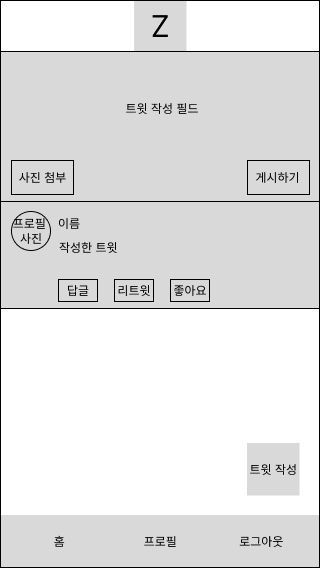

## 자기소개

반갑습니다. 현재 프론트엔드 개발자를 꿈꾸는 최현철입니다. 어떤 포트폴리오를 만들어볼까 생각하던 도중, 마침 노마드코더에서 클론코딩 챌린지를 한다고 하기에 부리나케 참여했습니다.

## 메인 페이지 와이어프레임

모바일 기반으로 프레임을 제작하였고, 레이아웃은 X와 동일하게 제작해볼 생각입니다.

원래는 저만에 스타일로 레이아웃을 꾸며볼까했지만 클론 코딩인 만큼, 제대로 따라해보는 것이 더 중요하다고 생각되어 'Z'라는 이름으로 만들어볼까합니다.

## 포인트 색상/로고/기타 구현하고 싶은 사항

색상 팔레트는 X와 동일하게 사용할 것이고, 로고는 직접 제작할 예정입니다. X의 기본적인 기능들은 전부 넣어보고 싶습니다. CSS 애니메이션, Tweet 답글, 좋아요 등등..

제가 구상한 모습대로 잘 나왔으면 좋겠습니다. 화이팅 !!
