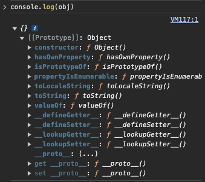
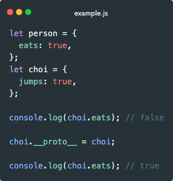
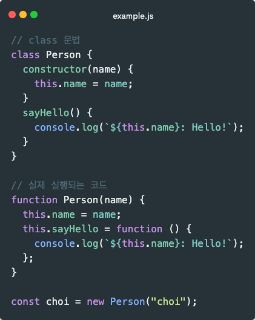
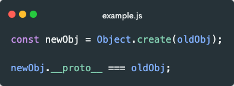
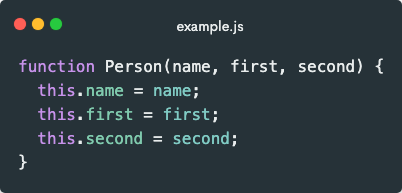
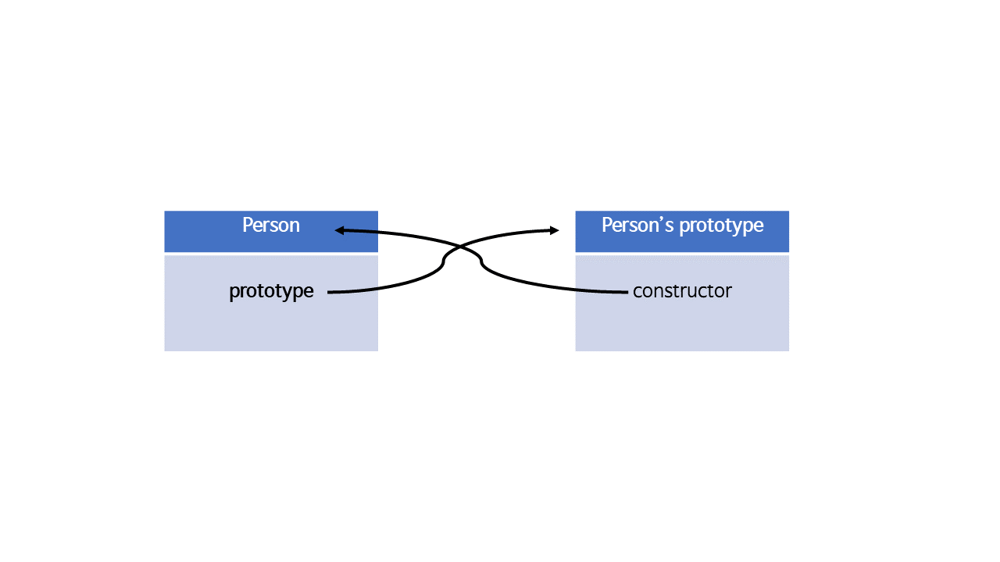
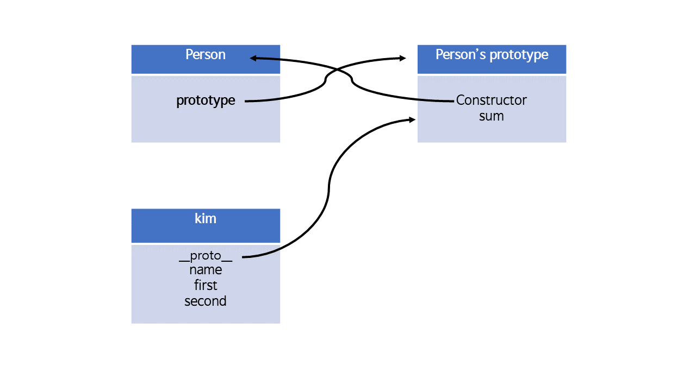
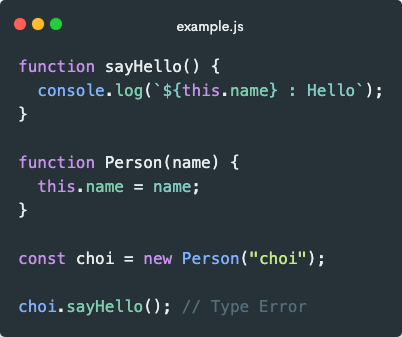
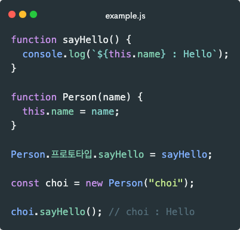

JavaScript로 개발할 때, `console.log`를 많이 사용하시죠? JavaScript에서 객체를 콘솔에 찍어보면 `[[Prototype]]`이라는 프로퍼티가 존재합니다. 개발자가 추가하지 않은 이 프로퍼티는 대체 무엇일까요?



## 프로토타입이란?

JavaScript의 객체는 `[[Prototype]]`이라는 숨김 프로퍼티를 갖습니다. 이 숨김 프로퍼티 값은 `null`이거나 다른 객체에 대한 참조가 되는데, 다른 객체를 참조하는 경우 참조 대상을 **프로토타입**이라 부릅니다.

JavaScript는 객체에서 프로퍼티를 읽으려고 할 때 해당 프로퍼티가 없으면 자동으로 `Prototype`에서 프로퍼티를 찾습니다. 이게 `Prototype`의 신비한 점입니다.

`[[Prototype]]` 프로퍼티는 숨김 프로퍼티이지만 특정한 방법들을 통해 개발자가 값을 설정할 수 있습니다.

간단한 예시를 들어볼까요?



<!-- ```javascript
let person = {
  eats: true,
};
let choi = {
  jumps: true,
};

console.log(choi.eats); // false

choi.__proto__ = choi;

console.log(choi.eats); // true
``` -->

위 예시를 보면 `choi` 내에는 `eats`가 없지만 `__proto__`로 `choi`의 `Prototype`을 `person`로 지정하니 `choi.eats`가 `true`가 되었습니다.

이처럼 JavaScript에서만 고유하게 데이터를 공유하는 방식을 **프로토타입 체이닝 - 프로토타입 체이닝**이라고 합니다.

### 프로토타입에 대한 오해

프로토타입을 공부하다 보면 **프로토타입 상속**이라는 개념이 많이 나오는데요. 엄밀히 말하자면 `Prototype`은 클래스와 같은 상속의 개념이 아닙니다. JavaScript에 `class`는 없습니다. 또한 내용을 복사해서 일어나는 상속도 없습니다.

`Prototype`은 클래스, 객체의 내용 복사 없이 상속을 구현할 수 있게 해주는 방법입니다. 즉, `Prototype`은 상속이 아닌 **연결**이라고 할 수 있겠습니다.

그럼 어떻게 동작을 하는 것인지 의문점들을 하나씩 해결해 봅시다.

#### 의문점 하나.

**클래스가 없는데 객체를 어떻게 설계대로 찍어낼 수 있을까요?**

클래스는 객체를 찍어내는 틀이라고 볼 수 있습니다. JavaScript에서도 class 문법이 존재합니다만, 실제로 실행되는 코드는 클래스가 아닌 함수입니다.



<!-- ```javascript
// class 문법
class Person {
  constructor(name) {
    this.name = name;
  }
  sayHello() {
    console.log(`${this.name}: Hello!`);
  }
}

// 실제 실행되는 코드
function Person(name) {
  this.name = name;
  this.sayHello = function () {
    console.log(`${this.name}: Hello!`);
  };
}

const choi = new Person("choi");
``` -->

함수 구조가 참 이상한데요. 클래스가 아니라면 return이 없는데 객체가 어떻게 생성되는 걸까요?

그것은 바로 함수와 `new` 연산자가 만나면 JavaScript 단에서 숨겨진 일들이 일어나기 때문입니다.

1. `new` 연산자가 새로운 빈 객체를 메모리상에 생성한다.
2. 생성된 빈 객체가 `this`에 바인딩 된다.
3. `this` 객체의 속성을 채우는 동작이 수행된다.
4. 만약 `Animal` 함수에서 `return`하는 것이 없다면 3번에서 만들어진 `this`가 `return`된다.

#### 의문점 둘.

**복사 없이 어떻게 상속을 수행할 수 있을까요?**

일반적인 클래스라면, 하나의 클래스가 부모 클래스로부터 상속을 받을 때 만들어진 인스턴스에는 부모 클래스와 자식 클래스의 모든 내용이 해당 인스턴스에도 반영됩니다. 하지만 JavaScript에서는 불가능한 방식입니다. 왜냐하면 JavaScript는 객체나 코드 내용 자체를 복사하는 **깊은 복사를 수행하지 않기 때문입니다.**

이러한 조건에서도 상속을 흉내 내기 위해서 객체를 서로 연결하는 개념을 활용하는데 이것이 바로 `Prototype`인 것입니다.

## 프로토타입 체이닝

그럼 이제 프로토타입 체이닝에 대해서 자세히 알아봅시다.

제가 프로토타입은 객체를 서로 연결해 주는 것이라고 하였는데요. 객체들을 서로 연결하는 링크를 `__proto__`라고 이해하시면 됩니다. 이러한 객체와 객체 간의 연결 방법을 총 세 가지로 나누어 볼 수 있습니다.

1. **다른 객체를 바탕으로 만들어진 경우**

객체는 자신의 원형(프로토타입)이라고 할 수 있는 객체가 있다면 그 객체를 가리키는 `__proto__` 링크를 자동으로 가지게 됩니다.



<!-- ```javascript
const newObj = Object.create(oldObj);

newObj.__proto__ === oldObj;
``` -->

2. **일반적인 객체가 아닌 함수 객체인 경우**

이 경우 함수가 생성될 때 또 다른 객체인 `Prototype` 객체도 같이 생성됩니다. 이 두 객체는 서로 연관되어 있으며 서로서로 알아야 합니다.

예를 들어보자면,



<!-- ```javascript
function Person(name, first, second) {
  this.name = name;
  this.first = first;
  this.second = second;
}
``` -->

위와 같이 객체를 선언하면 `Person` 객체만 생성되는 것이 아닌 `Person's 프로토타입` 객체도 같이 생성됩니다. `Person` 객체의 `Prototype` 프로퍼티는 `Person's 프로토타입` 객체를 가리키고 `Person's 프로토타입` 객체의 `constructor` 프로퍼티는 `Person` 객체를 가리키는 것이죠.



3. **new + 함수로 만들어진 객체의 경우**

의문점 부분에서 new 연산자와 함수가 만나면 숨겨진 작업이 실행된다고 말씀드렸었는데 이때 하나 더 작업이 실행됩니다.

`new` 연산자로 만들어진 새로운 객체에 `__proto__`링크가 `Person` 객체의 `Prototype`을 가리키게 됩니다.



코드로 예를 들어볼게요.



<!-- ```javascript
function sayHello() {
  console.log(`${this.name} : Hello`);
}

function Person(name) {
  this.name = name;
}

const choi = new Person("choi");

choi.sayHello(); // Type Error
``` -->

위와 같이 코드를 짜면 당연히 에러가 발생합니다. `choi`에는 `sayHello`가 없기 때문이죠. 하지만 한 줄만 추가하면 에러가 해결됩니다.



<!-- ```javascript
function sayHello() {
  console.log(`${this.name} : Hello`);
}

function Person(name) {
  this.name = name;
}

Person.프로토타입.sayHello = sayHello;

const choi = new Person("choi");

choi.sayHello(); // choi : Hello
``` -->

분명 `Person` 객체의 `sayHello` 메소드를 추가했는데 `choi` 객체에서도 접근이 가능한 신기한 일이 발생하는데요. 이게 바로 프로토타입 체이닝입니다. 프로토타입 Chaing은 한 문장으로 정리하자면 **`__proto__`를 따라 계속 탐색하는 것**이라 할 수 있습니다.

그렇게 끝까지 탐색하다 `Object`라는 생성자 함수의 `Prototype` 객체에 도달하게 되면 탐색을 종료하게 됩니다. `Object 프로토타입`의 `__proto__`에는 `null`이 들어가 있어 결국 찾지 못하게되면 `undefined`를 반환하게 됩니다.
