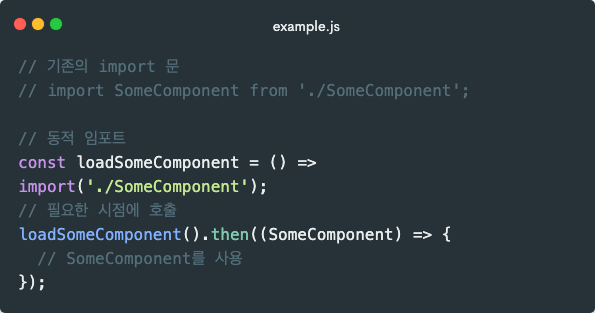
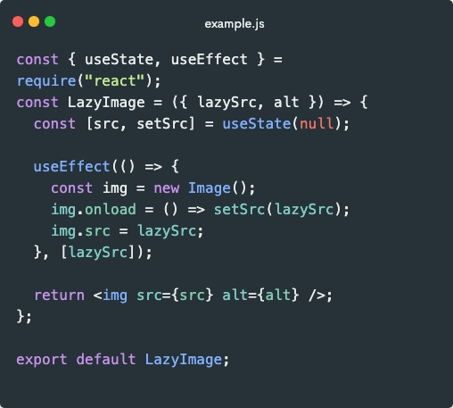
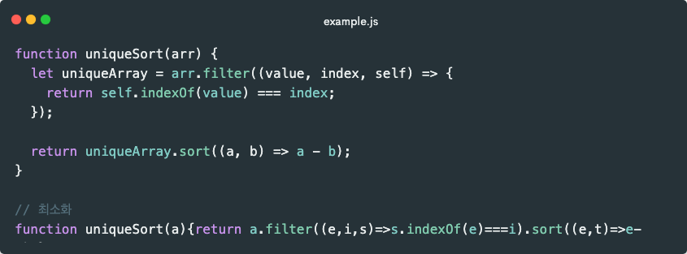
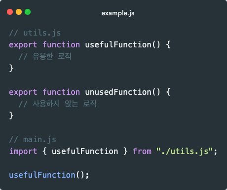
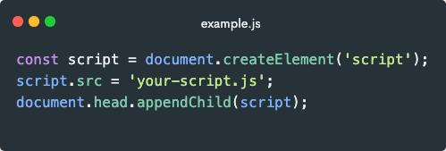
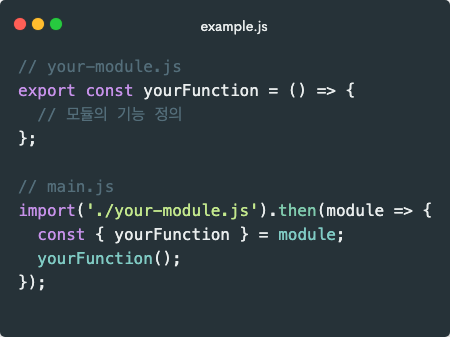
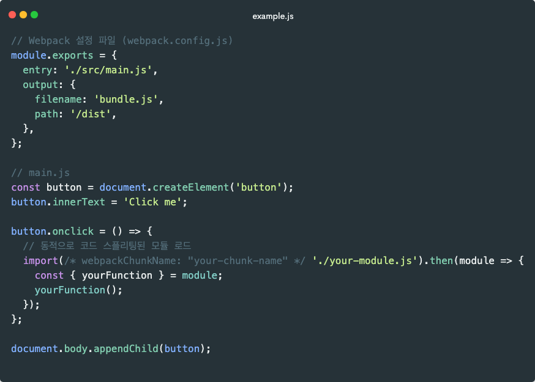

지난 콘텐츠에서는 SPA가 무엇이고, 어떠한 특징들을 가지고 있는지에 대해 중점적으로 소개해드렸습니다. 이제 SPA가 무엇인지 알았으니 활용하는 법에 대해 알아볼까요?

## SPA 아키텍처 이해

### SPA의 기본 구조와 작동 원리

SPA는 웹 애플리케이션 또는 웹사이트가 단일 HTML 페이지에서 동적으로 업데이트되어 사용자와의 상호 작용을 효율적으로 관리하는 구조입니다. 하나의 HTML 파일을 기반으로 하며, 이 파일은 초기 로딩 시에 브라우저로 전송됩니다. 이 HTML 파일은 기본적인 레이아웃 및 스켈레톤을 포함하고 있으며, 정적 자원(CSS, JavaScript 등)과 함께 초기에 다운로드됩니다.

사용자가 SPA에 접속하면, 초기에 필요한 HTML 및 정적 자원이 다운로드됩니다. 사용자가 다른 페이지로 이동하면, 브라우저는 필요한 데이터만을 서버로부터 비동기적으로 가져와서 현재 페이지를 동적으로 업데이트합니다. 이때 Ajax와 같은 비동기 통신 기술을 사용하여 데이터를 주고받습니다.

SPA의 핵심은 전체 페이지를 새로 고치지 않고도 필요한 부분만 업데이트하여 사용자 경험을 향상시키는 데에 있습니다. 초기 로딩에는 모든 필요한 자원을 다운로드해야 하므로 시간이 소요되지만, 그 후의 상호작용은 빠르게 이루어집니다.

### CSR과 SSR의 차이점

클라이언트 사이드 렌더링(CSR)은 브라우저가 서버로부터 데이터를 받아 클라이언트 측에서 HTML을 생성하는 방식입니다. SPA 대부분은 이 방식을 사용합니다. 자세한 내용은 이전 포스트를 참고해보세요.

서버 사이드 렌더링(SSR)은 서버에서 모든 HTML을 생성하고 완성된 페이지를 클라이언트에 보내는 방식입니다. 초기 로딩속도가 빠르고 SEO(검색엔진최적화)에 유리하지만, 페이지간 이동 시 전체 페이지를 다시 로드해야 하죠.

CSR은 동적이고 사용자 상호작용이 많은 애플리케이션에 적합하며, SSR은 콘텐츠 중심의 정적인 웹사이트나 SEO가 중요한 경우에 적합합니다. 일부 프레임워크 및 라이브러리는 두 가지 방식을 혼합하여 사용하는 형태도 있습니다. 이를 "Hybrid Rendering" 또는 "Universal Rendering"이라고 부릅니다.

### SPA의 라이프 사이클 관리

애플리케이션은 초기화, 뷰 렌더링, 이벤트 처리, 데이터 업데이트 등 여러 단계를 거칩니다. 또 상태 관리는 사용자 인터페이스의 일관성을 유지하고 복잡한 데이터 흐름을 관리하는 데 중요하죠. FE 프레임워크 (React, Angular, Vue)를 사용하면 이러한 과정을 쉽게 사용할 수 있습니다.

라이프 사이클 관리는 애플리케이션의 성능 최적화와 사용자 경험 향상에 중요한 역할을 합니다. 예를 들어, 불필요한 데이터 로딩을 피하고, 사용자 상호작용에 빠르게 반응하는 등의 방법이 있습니다.

그럼 라이프 사이클은 어떻게 구성되어 있는지 알아볼까요?

#### 라이프 사이클 단계

주어진 라이프 사이클 단계들은 SPA의 실행 흐름을 나타내는 일반적인 단계입니다. 각 라이프 사이클 단계는 애플리케이션이 실행되고 사용자와 상호작용할 때 일어나는 주요한 시점을 나타냅니다. 각 라이프 사이클 단계에 대하여 간략하게 설명해보겠습니다.

#### 1. 초기화 단계 (Initialization)

애플리케이션이 로드되면 초기 설정이 이루어집니다. 이는 라우팅, 상태 관리, 서비스 초기화 등과 관련이 있습니다. 애플리케이션의 초기 상태를 설정하고 필요한 자원을 불러오는 등의 작업이 이루어집니다.

#### 2. 뷰 렌더링 단계 (View Rendering)

초기화 단계 이후에는 사용자에게 보여지는 뷰가 렌더링되는 단계입니다. 이는 초기 화면을 구성하거나, 사용자가 다른 페이지로 이동할 때 해당 페이지의 컴포넌트가 렌더링되는 등의 작업이 이루어집니다.

#### 3. 이벤트 처리 단계 (Event Handling)

사용자의 상호작용에 대한 이벤트(클릭, 입력 등)를 감지하고 처리하는 단계입니다. 사용자의 입력에 따라 애플리케이션이 어떻게 반응할지를 정의하고, 이벤트 핸들러를 통해 해당 동작을 수행합니다.

#### 4. 데이터 업데이트 단계 (Data Update)

사용자와의 상호작용, 이벤트 처리 등으로 인해 애플리케이션의 상태가 변경되면 해당 변경 사항에 대한 데이터 업데이트가 이루어집니다. 이는 상태 관리를 통해 관리되며, 데이터의 변경에 따라 UI가 업데이트됩니다.

#### 5. 종료 단계 (Termination)

애플리케이션이 종료되거나 사용자가 페이지를 나갈 때 발생하는 단계입니다. 이 단계에서는 정리 작업이 수행되거나 필요한 리소스가 해제됩니다.

이러한 라이프 사이클 단계는 주로 프론트엔드 프레임워크나 라이브러리에서 관리되며, 각각의 단계에서 특정 메서드나 훅을 통해 사용자 정의 로직을 삽입할 수 있습니다. 각 프레임워크나 라이브러리마다 라이프 사이클 단계와 관련된 특정한 API가 제공됩니다.

## SPA 성능 최적화 전략

### Code splitting (코드 분할)

애플리케이션의 번들을 여러 청크(작은 단위)로 나누어 필요할 때만 로드하는 것을 의미합니다. SPA에서 모든 코드를 한 번에 로드하면 초기 로딩 시간이 길어질 수 있습니다.하지만 Code Splitting을 사용하면 사용자가 실제로 필요로 하는 기능의 코드만 로드하여 초기 로딩 시간을 줄일 수 있습니다.

동적 `import()` 함수를 사용하여 코드를 비동기적으로 로드하는 방법입니다. 이 함수를 사용하면 특정 모듈이나 파일이 필요한 시점에 동적으로 로딩됩니다.

### Lazy Loading

사용자에게 필요할 때까지 자원(이미지, 컴포넌트 등)을 로드하지 않는 기술로 불필요한 자원 로드를 방지하고, 초기 성능을 개선하는 데 도움을 줍니다.

웹 페이지에 있는 모든 이미지를 초기에 한 번에 로드하지 않고, 사용자가 스크롤하거나 특정 이미지가 필요한 시점에 비로소 로드하여 대역폭을 절약하고 초기 로딩 속도를 향상시킵니다.

이 컴포넌트를 사용하면 이미지가 실제로 필요한 시점에 비동기적으로 로드되며, 이는 성능 최적화 및 대역폭 효율성을 향상시킬 수 있습니다.

### JavaScript 최적화

Javascript 최적화는 웹 애플리케이션의 성능을 향상시키기 위한 프로세스입니다. 로딩시간 감소, 브라우저 렌더링 향상 및 전반적인 사용자 경험 개선을 목표로 합니다. SPA는 주로 클라이언트 측에서 렌더링되며 Javascript에 크게 의존합니다. 최적화를 통해 빠른 로딩 시간과 부드러운 인터랙션을 제공할 수 있습니다.

#### Minification (코드 최소화)

파일 크기를 줄이고 네트워크 지연 시간을 최소화하여 웹사이트의 로딩 속도를 향상시킬 수 있습니다. 불필요한 공백, 주석, 들여쓰기 등을 제거하여 파일 크기를 최소화합니다. 작은 파일 크기는 더 빠른 다운로드와 로딩을 의미합니다.

최소화된 파일은 클라이언트와 서버 간의 데이터 전송이 빨라져 네트워크 지연 시간을 감소시킵니다. 파일 크기가 작아지면 브라우저가 JavaScript 파일을 다운로드하고 해석하는 시간이 단축되어 웹 페이지의 로딩 속도가 개선됩니다.

#### 불필요한 코드 제거 (Tree Shaking)

Tree Shaking은 사용되지 않는 코드를 제거하여 최종 번들의 크기를 최소화합니다. 작은 번들 크기는 빠른 다운로드와 로딩을 가능케 합니다. 또한 브라우저가 애플리케이션을 다운로드하고 해석하는 시간을 단축하여 로딩 속도를 향상시킵니다. 사용되지 않는 코드를 제거함으로써 자원 사용 효율성을 높여 메모리 사용을 최적화할 수 있습니다.

위와 같은 상황에서는 `unusedFunction()` 은 과감하게 제거합니다.

#### 비동기 로딩 (Asynchronous Loading)

비동기 로딩은 필요한 자원을 필요한 시점에 로드하여 초기 로딩 시간을 단축하고 사용자 경험을 개선하는 기법 중 하나입니다. 특히 SPA와 같이 대규모의 자바스크립트 코드를 다룰 때 유용합니다.

필요한 자원만 로드하기 때문에 초기 로딩 속도를 개선할 수 있습니다. 사용자는 페이지를 더 빠르게 확인할 수 있습니다. 또한 페이지의 기본적인 구조나 콘텐츠는 빠르게 표시되며, 추가적인 자원은 필요에 따라 로드되므로 사용자 경험이 향상됩니다. 필요한 자원만 로드함으로써 불필요한 자원 로딩을 방지하고 자원 사용 효율성을 높일 수 있습니다.

사용 방법은 다음과 같습니다.

**1. `<script>` 태그의 `async` 및 `defer` 속성 활용**

`<script>` 태그에 `async` 속성을 추가하면 자바스크립트 파일이 비동기로 로드됩니다. defer 속성은 비동기로 로드되지만 실행 순서는 순차적으로 보장됩니다.

**2. 동적으로 스크립트 추가**

JavaScript에서 동적으로 `<script>` 요소를 생성하고 추가함으로써 비동기로 스크립트를 로드할 수 있습니다.

**3. 모듈 시스템 활용**

ES6(ECMAScript 2015)부터 도입된 모듈 시스템은 JavaScript 파일을 모듈로 분리할 수 있게 해주는 기능입니다. 이를 통해 필요한 모듈만 동적으로 로드할 수 있습니다.

위 코드에서 `import('./your-module.js')`는 모듈을 비동기적으로 가져오는 부분입니다. 모듈이 로드되면 `then` 블록 안에서 해당 모듈을 사용할 수 있습니다.

**4. Webpack과 같은 번들러 설정**

모듈 번들러인 Webpack을 사용하면 코드 스플리팅과 함께 비동기 로딩을 손쉽게 구현할 수 있습니다. Webpack은 코드를 논리적인 덩어리(청크)로 나누어 필요한 부분만 로드할 수 있도록 해줍니다.

Webpack 설정 파일에서 `/* webpackChunkName: "your-chunk-name" */` 주석은 Webpack이 해당 청크에 이름을 부여하도록 하는 부분입니다. 이를 통해 각 청크에 대한 이름을 설정할 수 있습니다.

이러한 방식으로 Webpack은 필요한 모듈을 동적으로 로드하여 코드 스플리팅과 비동기 로딩을 지원하게 됩니다. 원하는 기능이나 모듈이 사용자의 상호작용에 따라 필요한 시점에만 로드되기 때문에 초기 로딩 시간이 감소하고 효율적인 웹 성능을 제공할 수 있습니다.
